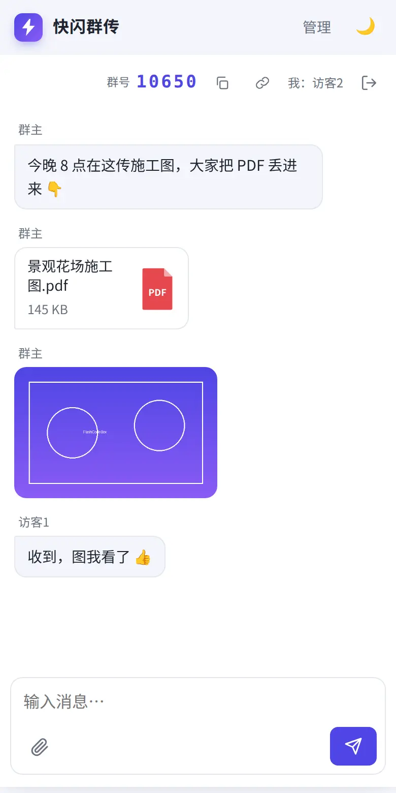

<div align="center">


# FlashCodeBox

### An ephemeral LAN group chat — share a code, send files like messages

**Same Wi-Fi, zero setup. Auto-dissolves on expiry. Your data never leaves the network.**

[](./LICENSE)
[](./go.mod)
[](#docker)

[中文](./README.md)

</div>


## What is this

A **single-binary, zero-dependency** temporary group chat for your local network. Open the web page and you get a WeChat-style chat window:

- Send the first message (or file) → a group is **created automatically** with a 5-digit **group code**; you are the **owner**
- Share the group code or invite link with anyone on the same Wi-Fi → they join instantly as a **guest** (unlimited participants)
- Text, files and images; chunked uploads that **saturate your LAN**; click an image to open a lightbox
- When it expires (default: 1 day) the whole group — messages and files — is **deleted automatically**

Great for: **sharing meeting materials, moving large files between colleagues, swapping photos at home, or any "no sign-up" quick-transfer scenario.**

## One command

### Docker (recommended)

```bash
git clone https://github.com/chenxinfeng4/FlashCodeBox.git
cd FlashCodeBox
docker compose up -d --build
```

Or use the one-shot script (builds the image if missing and prints the LAN URL):

```bash
bash scripts/quickstart.sh
```

Or use the published image directly:

```bash
docker run -d --restart unless-stopped \
  -p 12345:12345 \
  -v flashcodebox-data:/data \
  -e TZ=Asia/Shanghai \
  --log-opt max-size=10m --log-opt max-file=3 \
  --name flashcodebox \
  ghcr.io/chenxinfeng4/flashcodebox:latest
```

Then open `http://localhost:12345`.

> `docker-compose.yml` uses a named volume (`flashcodebox-data`) so it works out of the box. The container runs as uid 1000; if you switch to a bind mount, `sudo chown -R 1000:1000 ./data` first (or use `scripts/quickstart.sh`, which runs as your own user).
>
> The Dockerfile defaults to China mirrors (apk = Tsinghua, npm = npmmirror, GOPROXY = goproxy.cn). Override for international builds: `docker build --build-arg APK_MIRROR=dl-cdn.alpinelinux.org --build-arg NPM_REGISTRY=https://registry.npmjs.org --build-arg GOPROXY=https://proxy.golang.org,direct .`

### Local binary (no Docker)

Requires Go 1.27+ and Node 20+:

```bash
bash scripts/build.sh          # Vite build → Go embed → build/flashcodebox
./build/flashcodebox -port 12345 -data ./data
```

The startup log prints reachable LAN addresses:

```
快闪群传 (FlashCodeBox) 1.0.0 已启动: http://:12345  data dir: /path/to/data
局域网访问: http://192.168.1.20:12345
```

## Initialization

The site needs an **admin password** on first use (only for the admin panel — chatting needs no account):

1. Open the homepage → **管理 (Admin)** in the top-right → set the admin password (≥ 8 chars)
2. Everything else (site name, upload limits, chunk size, code type, type whitelist, expiry cap, rate limit…) is editable in the admin panel and applies live

For automated deployments:

```bash
ADMIN_PASSWORD=yourpassword bash scripts/init-admin.sh
# BASE=http://127.0.0.1:8080 ADMIN_PASSWORD=... bash scripts/init-admin.sh
```

## Features

| | |
|---|---|
| **Ephemeral by design** | No sign-up; first message creates the group; join with a 5-digit code or invite link |
| **LAN first** | Prints LAN addresses on startup; files travel inside your network only |
| **Text / files / images** | Chat bubbles, file cards with type icons, image thumbnails + lightbox |
| **Large files** | Chunked upload (5 MB chunks) with byte-level progress and speed; resumable; sha256 verified |
| **Auto cleanup** | Expiry default 1 day (hour/day/never); background janitor removes expired/empty groups and stale chunks |
| **Owner controls** | Owner can disable guest replies, change retention, copy code/invite link |
| **Single binary** | Frontend is embedded; SQLite via pure Go; no runtime deps, easy cross-compilation |
| **Reverse-proxy ready** | All-relative URLs, no absolute URL generation; works under any sub-path/port |
| **Light/dark theme** | One-click toggle; full mobile layout |



## Configuration

| flag | env | default | description |
|------|-----|---------|-------------|
| `-port` | `PORT` | `12345` | listen port (binds `0.0.0.0` by default) |
| `-data` | `DATA_DIR` | `./data` | data dir (db / files / config) |
| `-trusted-proxies` | `TRUSTED_PROXIES` | empty | trusted proxy CIDRs (comma separated) for real client IP |
| `-debug` | `DEBUG=1` | off | debug logging |

All other settings live in the admin panel.

## Reverse proxy

```nginx
server {
    listen 443 ssl;
    server_name chat.example.com;

    location /chat/ {
        proxy_pass http://127.0.0.1:12345/;
        proxy_set_header Host $host;
        proxy_set_header X-Forwarded-For $proxy_add_x_forwarded_for;
        client_max_body_size 6m;   # slightly above chunk size
    }
}
```

Use `-trusted-proxies` (e.g. `127.0.0.1/32,10.0.0.0/8`) if you need real client IPs for logging/rate limiting.

## Tech stack

- **Backend**: Go 1.27 · Gin · `modernc.org/sqlite` (pure Go, no CGO)
- **Frontend**: Vite 7 · React 19 · hand-written CSS (light/dark CSS variables), embedded via `go:embed`
- **Storage**: everything under `-data` — `flashcodebox.db`, `share/`, `chunks/`; stop and copy the directory to back up

## FAQ

<details>
<summary>Phones / other computers can't open it</summary>

Use the **LAN IP** (e.g. `http://192.168.1.20:12345`), not `localhost`; check the firewall; for Docker make sure the port is mapped. The `局域网访问:` line in the startup log is the correct address.

</details>

<details>
<summary>Large files fail to upload</summary>

Default per-file limit is 1 GiB, 5 MiB chunks — adjust both in the admin panel. Behind a proxy, set `client_max_body_size` slightly above the chunk size.

</details>

<details>
<summary>Is data kept after expiry?</summary>

No. The background janitor deletes messages and files of expired groups. Back up the `-data` directory while stopped.

</details>

## Acknowledgements

This project was inspired by [FileCodeBox](https://github.com/vastsa/FileCodeBox) — an anonymous passcode-sharing tool where you "pick up files like express delivery". Kudos to its elegant idea: one short passcode, one share.

Both projects share the same core philosophy:

- **Self-hosted / LAN friendly**: runs on your own machine; your data stays under your control
- **Large files**: chunked uploads
- **Drag & drop upload** (FlashCodeBox also supports paste)
- **Passcode (CODE) access**: no sign-up, just a short code / group code

On top of that, FlashCodeBox makes two different choices:

| | FileCodeBox | FlashCodeBox |
|---|---|---|
| **Conversational UI** | Cabinet-style: upload → get a passcode → recipient picks up | **WeChat-style chat window**: sending the first message creates the group — sharing feels like chatting, friendlier for non-technical users |
| **Multiple shares per session** | One share ↔ one passcode; repeat for every file | **Keep sending in one session**: send text and any number of files in the group; everyone sees them in real time and can download anytime |
| **Same-window send & receive** | Uploading and picking up live on two separate pages | **Sender and recipient share one interface**: send and receive in the same chat window — no page switching |
| **Sub-path reverse proxy** | — | **Any sub-path/port out of the box** (e.g. `https://chat.example.com/chat/`); all-relative URLs, zero rewrites |

## Contributing

Issues and PRs are welcome. Please make sure `go test ./...` and the frontend build pass.

## License

[MIT](./LICENSE) © 2026 chenxinfeng (陈昕枫)

## Disclaimer

This project is intended for lawful file/text sharing only. Do not upload, store, or distribute illegal, infringing, or unauthorized content. Users are responsible for their deployment and content.

<div align="center">

**If FlashCodeBox helps you, please give it a Star ⭐**

</div>
